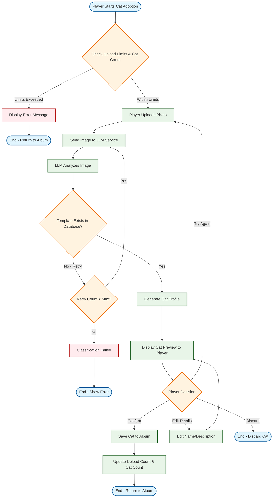

# 5.c.iii Activity Diagram / State / Processes
## Cat Adoption Process Activity Diagram

```mermaid
flowchart TD
    Start([Player Starts Cat Adoption]) --> CheckLimits{Check Upload Limits & Cat Count}
    
    CheckLimits -->|Limits Exceeded| LimitError[Display Error Message]
    LimitError --> End1([End - Return to Album])
    
    CheckLimits -->|Within Limits| UploadPhoto[Player Uploads Photo]
    UploadPhoto --> SendToLLM[Send Image to LLM Service]
    
    SendToLLM --> LLMClassify[LLM Analyzes Image]
    LLMClassify --> ValidateTemplate{Template Exists in Database?}
    
    ValidateTemplate -->|No - Retry| RetryCheck{Retry Count < Max?}
    RetryCheck -->|Yes| SendToLLM
    RetryCheck -->|No| ClassifyError[Classification Failed]
    ClassifyError --> End2([End - Show Error])
    
    ValidateTemplate -->|Yes| GenerateCat[Generate Cat Profile]
    GenerateCat --> ShowPreview[Display Cat Preview to Player]
    
    ShowPreview --> PlayerDecision{Player Decision}
    PlayerDecision -->|Confirm| SaveCat[Save Cat to Album]
    PlayerDecision -->|Try Again| UploadPhoto
    PlayerDecision -->|Edit Details| EditDetails[Edit Name/Description]
    PlayerDecision -->|Discard| End3([End - Discard Cat])
    
    EditDetails --> ShowPreview
    SaveCat --> UpdateLimits[Update Upload Count & Cat Count]
    UpdateLimits --> End4([End - Return to Album])

    %% Styling
    classDef startEnd fill:#e1f5fe,stroke:#01579b,stroke-width:2px
    classDef decision fill:#fff3e0,stroke:#ef6c00,stroke-width:2px
    classDef process fill:#e8f5e8,stroke:#1b5e20,stroke-width:2px
    classDef error fill:#ffebee,stroke:#b71c1c,stroke-width:2px
    
    class Start,End1,End2,End3,End4 startEnd
    class CheckLimits,ValidateTemplate,RetryCheck,PlayerDecision decision
    class UploadPhoto,SendToLLM,LLMClassify,GenerateCat,ShowPreview,SaveCat,UpdateLimits,EditDetails process
    class LimitError,ClassifyError error
```
