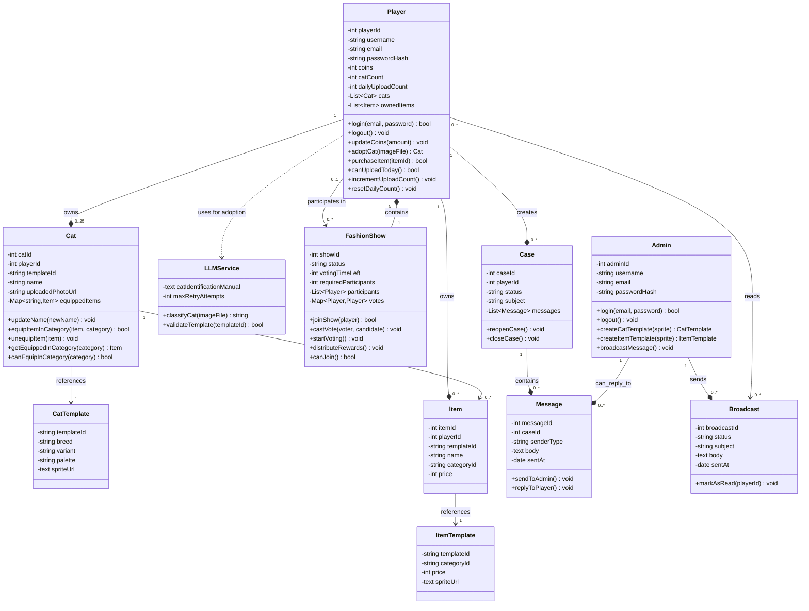

# 5. Design
## 5.b Structural Design - Class Diagram

# Cat Walk - Structural Design Class Diagram

```mermaid
classDiagram

class Player {
    -int playerId
    -string username
    -string email
    -string passwordHash
    -int coins
    -int catCount
    -int dailyUploadCount
    -List~Cat~ cats
    -List~Item~ ownedItems
    +login(email, password) bool
    +logout() void
    +updateCoins(amount) void
    +adoptCat(imageFile) Cat
    +purchaseItem(itemId) bool
    +canUploadToday() bool
    +incrementUploadCount() void
    +resetDailyCount() void
}

class Cat {
    -int catId
    -int playerId
    -string templateId
    -string name
    -string uploadedPhotoUrl
    -Map~string,Item~ equippedItems
    +updateName(newName) void
    +equipItemInCategory(item, category) bool
    +unequipItem(item) void
    +getEquippedInCategory(category) Item
    +canEquipInCategory(category) bool
}

class CatTemplate {
    -string templateId
    -string breed
    -string variant
    -string palette
    -text spriteUrl
}

class Item {
    -int itemId
    -int playerId
    -string templateId
    -string name
    -string categoryId
    -int price
}


class ItemTemplate {
    -string templateId
    -string categoryId
    -int price
    -text spriteUrl
}

class LLMService {
    -text catIdentificationManual
    -int maxRetryAttempts
    +classifyCat(imageFile) string
    +validateTemplate(templateId) bool
}

class FashionShow {
    -int showId
    -string status
    -int votingTimeLeft
    -int requiredParticipants
    -List~Player~ participants
    -Map~Player,Player~ votes
    +joinShow(player) bool
    +castVote(voter, candidate) void
    +startVoting() void
    +distributeRewards() void
    +canJoin() bool
}

class Admin {
    -int adminId
    -string username
    -string email
    -string passwordHash
    +login(email, password) bool
    +logout() void
    +createCatTemplate(sprite) CatTemplate
    +createItemTemplate(sprite) ItemTemplate
    +broadcastMessage() void
}

class Case {
    -int caseId
    -int playerId
    -string status
    -string subject
    -List~Message~ messages
    +reopenCase() void
    +closeCase() void
}

class Message {
    -int messageId
    -int caseId
    -string senderType
    -text body
    -date sentAt
    +sendToAdmin() void
    +replyToPlayer() void
}

class Broadcast {
    -int broadcastId
    -string status
    -string subject
    -text body
    -date sentAt
    +markAsRead(playerId) void
}

%% Core Entity Relationships:
Player "1" --* "0..25" Cat : owns
Player "1" --* "0..*" Item : owns
Cat "1" --> "0..*" Item : equips
Cat --> "1" CatTemplate : references
Item --> "1" ItemTemplate : references

%% Fashion Show Relationships:
FashionShow "1" --* "5" Player : contains
Player "0..1" --> "0..*" FashionShow : participates in

%% Communication Relationships:
Case "1" --* "0..*" Message : contains
Player "1" --* "0..*" Case : creates
Admin "1" --* "0..*" Broadcast : sends
Admin "1" --* "0..*" Message : can_reply_to
Player "0..*" --> "0..*" Broadcast : reads

%% Service Relationships:
Player ..> LLMService : uses for adoption
```
