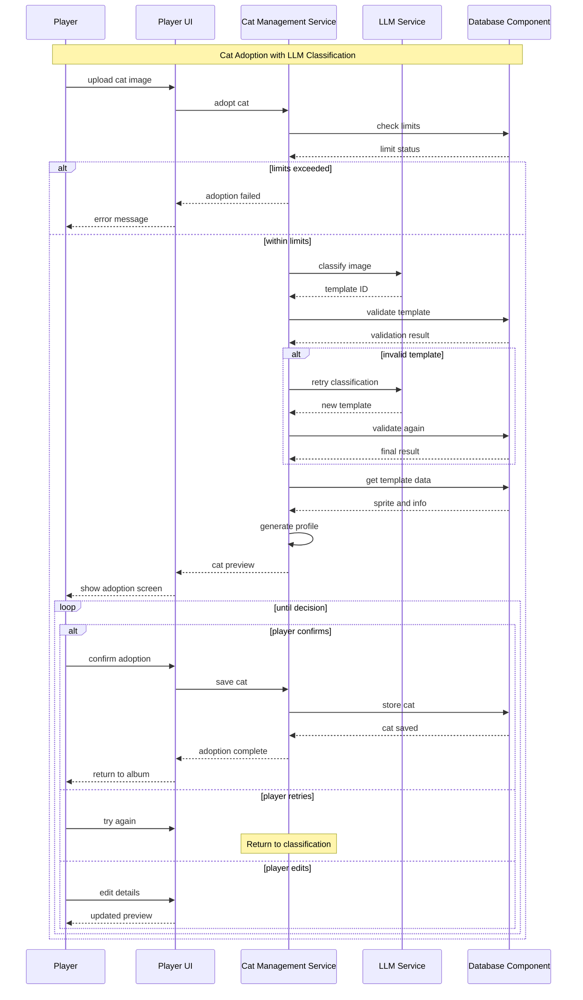
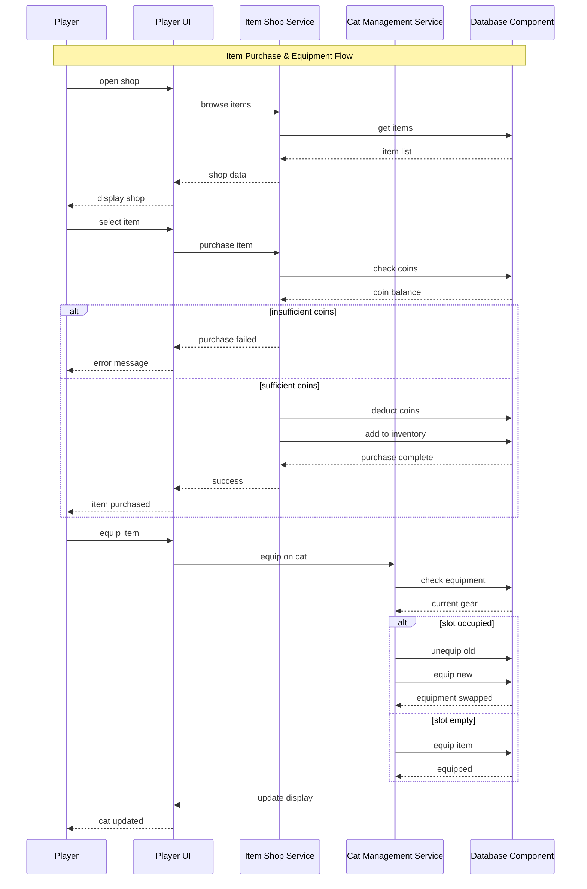
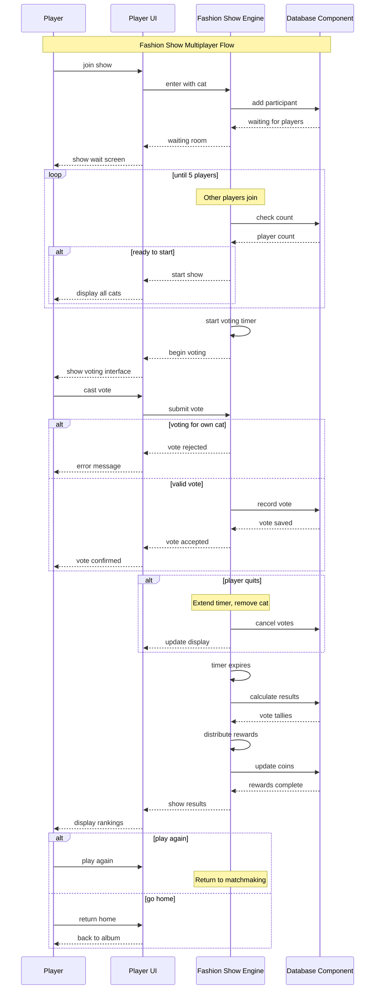

# 5. Design
## 5.c.ii Interactions Design - Sequence Diagram

### Diagram 1 - Cat Adoption Process

```mermaid
sequenceDiagram
    participant Player
    participant PUI as Player UI
    participant CatMgmt as Cat Management Service
    participant LLM as LLM Service
    participant DB as Database Component

    Note over Player, DB: Cat Adoption with LLM Classification

    %% Upload Image
    Player->>PUI: upload cat image
    PUI->>CatMgmt: adopt cat
    CatMgmt->>DB: check limits
    DB-->>CatMgmt: limit status
    
    alt limits exceeded
        CatMgmt-->>PUI: adoption failed
        PUI-->>Player: error message
    else within limits
        %% LLM Classification
        CatMgmt->>LLM: classify image
        LLM-->>CatMgmt: template ID
        CatMgmt->>DB: validate template
        DB-->>CatMgmt: validation result
        
        alt invalid template
            CatMgmt->>LLM: retry classification
            LLM-->>CatMgmt: new template
            CatMgmt->>DB: validate again
            DB-->>CatMgmt: final result
        end
        
        %% Generate Cat
        CatMgmt->>DB: get template data
        DB-->>CatMgmt: sprite and info
        CatMgmt->>CatMgmt: generate profile
        CatMgmt-->>PUI: cat preview
        PUI-->>Player: show adoption screen
        
        %% Player Decision
        loop until decision
            alt player confirms
                Player->>PUI: confirm adoption
                PUI->>CatMgmt: save cat
                CatMgmt->>DB: store cat
                DB-->>CatMgmt: cat saved
                CatMgmt-->>PUI: adoption complete
                PUI-->>Player: return to album
            else player retries
                Player->>PUI: try again
                Note over CatMgmt: Return to classification
            else player edits
                Player->>PUI: edit details
                PUI-->>Player: updated preview
            end
        end
    end
```

### Diagram 2 - Item Purchase & Equipment

```mermaid
sequenceDiagram
    participant Player
    participant PUI as Player UI
    participant ItemShop as Item Shop Service
    participant CatMgmt as Cat Management Service
    participant DB as Database Component

    Note over Player, DB: Item Purchase & Equipment Flow

    %% Browse Items
    Player->>PUI: open shop
    PUI->>ItemShop: browse items
    ItemShop->>DB: get items
    DB-->>ItemShop: item list
    ItemShop-->>PUI: shop data
    PUI-->>Player: display shop

    %% Purchase Item
    Player->>PUI: select item
    PUI->>ItemShop: purchase item
    ItemShop->>DB: check coins
    DB-->>ItemShop: coin balance
    
    alt insufficient coins
        ItemShop-->>PUI: purchase failed
        PUI-->>Player: error message
    else sufficient coins
        ItemShop->>DB: deduct coins
        ItemShop->>DB: add to inventory
        DB-->>ItemShop: purchase complete
        ItemShop-->>PUI: success
        PUI-->>Player: item purchased
    end

    %% Equip Item
    Player->>PUI: equip item
    PUI->>CatMgmt: equip on cat
    CatMgmt->>DB: check equipment
    DB-->>CatMgmt: current gear
    
    alt slot occupied
        CatMgmt->>DB: unequip old
        CatMgmt->>DB: equip new
        DB-->>CatMgmt: equipment swapped
    else slot empty
        CatMgmt->>DB: equip item
        DB-->>CatMgmt: equipped
    end
    
    CatMgmt-->>PUI: update display
    PUI-->>Player: cat updated
```

### Diagram 3 - Fashion Show Complete Flow

```mermaid
sequenceDiagram
    participant Player
    participant PUI as Player UI
    participant FashionShow as Fashion Show Engine
    participant DB as Database Component

    Note over Player, DB: Fashion Show Multiplayer Flow

    %% Join Show
    Player->>PUI: join show
    PUI->>FashionShow: enter with cat
    FashionShow->>DB: add participant
    DB-->>FashionShow: waiting for players
    FashionShow-->>PUI: waiting room
    PUI-->>Player: show wait screen
    
    %% Matchmaking
    loop until 5 players
        Note over FashionShow: Other players join
        FashionShow->>DB: check count
        DB-->>FashionShow: player count
        
        alt ready to start
            FashionShow-->>PUI: start show
            PUI-->>Player: display all cats
        end
    end
    
    %% Voting Phase
    FashionShow->>FashionShow: start voting timer
    FashionShow-->>PUI: begin voting
    PUI-->>Player: show voting interface
    
    Player->>PUI: cast vote
    PUI->>FashionShow: submit vote
    
    alt voting for own cat
        FashionShow-->>PUI: vote rejected
        PUI-->>Player: error message
    else valid vote
        FashionShow->>DB: record vote
        DB-->>FashionShow: vote saved
        FashionShow-->>PUI: vote accepted
        PUI-->>Player: vote confirmed
    end
    
    %% Handle Disruptions
    alt player quits
        Note over FashionShow: Extend timer, remove cat
        FashionShow->>DB: cancel votes
        FashionShow-->>PUI: update display
    end
    
    %% Results
    FashionShow->>FashionShow: timer expires
    FashionShow->>DB: calculate results
    DB-->>FashionShow: vote tallies
    FashionShow->>FashionShow: distribute rewards
    FashionShow->>DB: update coins
    DB-->>FashionShow: rewards complete
    FashionShow-->>PUI: show results
    PUI-->>Player: display rankings
    
    %% Continue Options
    alt play again
        Player->>PUI: play again
        Note over FashionShow: Return to matchmaking
    else go home
        Player->>PUI: return home
        PUI-->>Player: back to album
    end
```